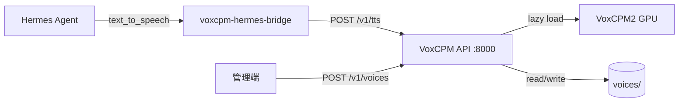

# VoxCPM Voice TTS API

以 `voice_id` 為核心的 VoxCPM TTS HTTP 服務，專為 [Hermes Agent](https://hermes-agent.nousresearch.com/) 的 command-type TTS provider 整合設計。

## 架構



1. 上傳 BASE64 參考音檔與逐字稿，建立 `voice_id`
2. 以 `voice_id` + 文字呼叫 `/v1/tts` 合成語音
3. Hermes 透過 `voxcpm-hermes-bridge` 橋接腳本呼叫 API

## 環境變數

| 變數 | 預設值 | 說明 |
| --- | --- | --- |
| `VOXCPM_VOICES_DIR` | `./voices` | voice library 儲存位置 |
| `VOXCPM_MODEL_NAME` | `openbmb/VoxCPM2` | HuggingFace 模型名 |
| `VOXCPM_LOAD_DENOISER` | `false` | 載入 denoiser |
| `VOXCPM_OPTIMIZE` | `false` | 啟用模型 optimize |
| `VOXCPM_DEVICE` | `auto` | 裝置選擇（由 voxcpm 處理） |
| `VOXCPM_API_URL` | `http://127.0.0.1:8000` | bridge 腳本使用的 API URL |
| `VOXCPM_DEFAULT_VOICE_ID` | — | bridge 腳本預設 voice_id |

## 本機執行

```bash
uv sync --group dev
uv run uvicorn voxcpm_api.main:app --host 0.0.0.0 --port 8000
```

## Docker 執行（CUDA）

### Docker Compose（建議）

```bash
docker compose up --build -d
```

停止服務：

```bash
docker compose down
```

環境變數可透過專案根目錄的 `.env` 覆寫（例如 `VOXCPM_MODEL_NAME`、`VOXCPM_DEVICE`）。

### 手動 docker run

```bash
docker build -t voxcpm-api .
```

啟動容器（bash / Git Bash）：

```bash
docker run --gpus all -p 8000:8000 \
  -v "$(pwd)/voices:/app/voices" \
  voxcpm-api
```

啟動容器（PowerShell）：

```powershell
docker run --gpus all -p 8000:8000 `
  -v "${PWD}/voices:/app/voices" `
  voxcpm-api
```

## API

所有 endpoint 前綴 `/v1`。

### 健康檢查

```bash
curl -s http://127.0.0.1:8000/v1/health
```

### 建立 voice

```bash
AUDIO_B64=$(base64 -w0 ref.wav)
curl -X POST http://127.0.0.1:8000/v1/voices \
  -H "Content-Type: application/json" \
  -d "{\"audio_base64\": \"${AUDIO_B64}\", \"reference_text\": \"你好，這是參考語音。\"}"
```

### 合成語音

```bash
curl -X POST http://127.0.0.1:8000/v1/tts \
  -H "Content-Type: application/json" \
  -d '{
    "voice_id": "<voice_id>",
    "text": "你好，這是 TTS 合成測試。",
    "cfg_value": 1.5,
    "inference_timesteps": 30,
    "response_format": "audio"
  }' \
  --output out.wav
```

`response_format` 可設為 `"json"`，回傳 `{ audio_base64, sample_rate, duration_sec }`。

### 參數範圍

| 欄位 | 範圍 |
| --- | --- |
| `cfg_value` | `0 < x <= 5.0`（預設 1.5） |
| `inference_timesteps` | `1 <= n <= 200`（預設 30） |

## Hermes Agent 整合

### 1. 註冊 voice

```bash
export VOICE_ID=$(curl -s -X POST http://127.0.0.1:8000/v1/voices \
  -H "Content-Type: application/json" \
  -d "{\"audio_base64\": \"${AUDIO_B64}\", \"reference_text\": \"你好\"}" \
  | jq -r .voice_id)

export VOXCPM_DEFAULT_VOICE_ID="$VOICE_ID"
```

### 2. 設定 Hermes

將 `hermes/config.example.yaml` 合併進 `~/.hermes/config.yaml`：

```yaml
tts:
  provider: voxcpm
  providers:
    voxcpm:
      type: command
      command: "voxcpm-hermes-bridge --text-file {input_path} --out {output_path}"
      output_format: wav
      timeout: 180
      voice_compatible: true
```

若 Hermes 跑在 Docker 內、API 在宿主機，改用：

```yaml
command: "voxcpm-hermes-bridge --api-url http://host.docker.internal:8000 --text-file {input_path} --out {output_path}"
```

### 3. 驗證 bridge

```bash
echo "你好，這是測試。" > /tmp/tts.txt
uv run voxcpm-hermes-bridge --text-file /tmp/tts.txt --out /tmp/out.wav
```

## 測試

```bash
uv run pytest tests -m "not gpu"
```

GPU smoke test（需實際模型）：

```bash
uv run pytest tests -m gpu
```
